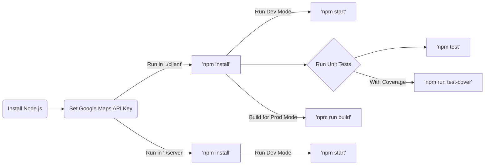

# Apollo Maps

A simple example project using Apollo Client and Server (GraphQL); and Google Maps JS API

Based on this [frontend challenge](https://github.com/W01fw00d/frontend-challenge)

Also based on this [Apollo Tutorial](https://odyssey.apollographql.com/)

## How to run



- Make sure you have Node.js installed.

- You need a Google Maps JS API Key.

Set the `key` in `client/src/secrets/dev/googleMapsAPI.json`

Please be aware that if the `key` doesn't belong to an account with Billing enabled, a pop-up will appear on page load and a "For development purposes only" watermark will be displayed on the map.

If you don't add an `key`, only the Google Maps features will be disabled.

- Commands (`client/`)

Install the dependencies:

```
npm install
```

Run the App locally in development mode (with hot-reload) in http://localhost:3000/ :

```
npm start
```

Run the Jest tests:

```
npm test
```

Generate a test coverage report in /coverage:

```
npm run test-cover
```

Build the App in production mode (for deploying in a server):

```
npm run build
```

- Commands (`server/`)

Install the dependencies:

```
npm install
```

Run the Dev Mode API Server:

```
npm start
```

## Troubleshooting

If you get a warning when using Chrome DevTools similar to:

`DevTools failed to load source map`

Try to disable the JavaScript source maps in DevTools preferences

[More details about this workaround in StackOverflow](https://stackoverflow.com/questions/35002087/disable-source-maps-in-chrome-devtools#:~:text=Open%20Developer%20Tools%2C%20go%20to,under%20the%20%22Sources%22%20settings.)

## Tech Stack

General

- TypeScript
- Webpack
- Babel

Client

- React
- Jest
- Material-UI (MUI)
- Apollo Client

Server

- Graphql
- Apollo Server
